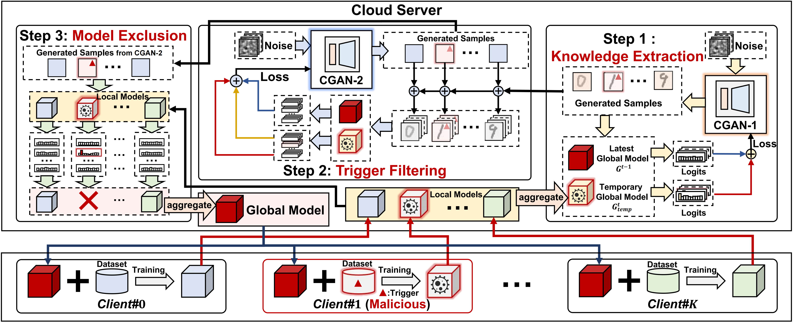

# FilterFL: Knowledge Filtering-based Data-Free Backdoor Defense for Federated Learning


## Introduction
This repository includes the implementation for our paper "FilterFL: Knowledge Filtering-based Data-Free Backdoor Defense for Federated Learning" accepted by CCS 2025.

## Installation
This project is built upon the following environment:
* python 3.8
* CUDA 11.3
* Pytorch 1.13.0
### No defense
```
python main.py
```
### Use our defense approach
```
python main.py --defense ours
```
## Citation
If you find our work insight or useful, please consider citing:
```
@inproceedings{FilterFL,
  title={{FilterFL}: Knowledge filtering-based data-free backdoor defense for federated learning},
  author={Yang, Yanxin and Hu, Ming and Xie, Xiaofei and Cao, Yue and Zhang, Pengyu and Huang, Yihao and Chen, Mingsong},
  booktitle={Proceedings of the ACM SIGSAC Conference on Computer and Communications Security (CCS)},
  pages={3147--3161},
  year={2025}
}
```
